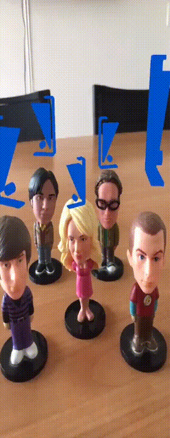

# ARHat | Face tracking in the 3D open world using Apple's Vision and ARKit

## Overview

This project is a small example of some of the capabilites Apple's Vision and ARKit offer and how they can be combined to perform 3D face tracking in the open world.

You can find more info on the topic in our blog article [here](https://blog.hattrick-it.com/face-tracking-in-the-open-world-with-apples-vision-and-arkit-2/)
